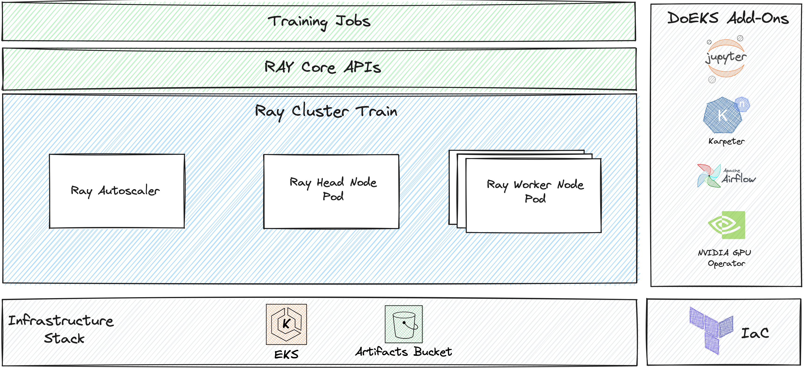
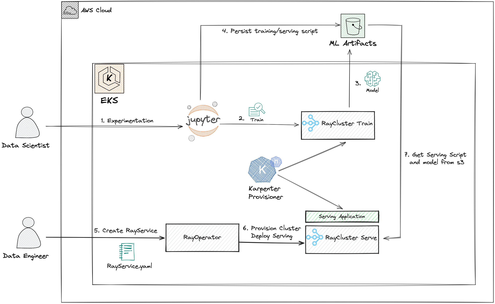

# Fine-tuning Foundation Models on Amazon EKS for AI/ML Workloads

In this all-in-one demo on Amazon EKS, we use JupyterHub to guide you through the initial stages of serving a pre-trained model and fine-tuning it with new data. We then shift gears to utilize Ray Operator for optimized serving and Karpenter for custom resource allocation. The demo showcases how to achieve cost-effectiveness and multi-tenancy with various Ray clusters, all while walking you through each step in a Jupyter notebook.
## Prerequisites

- AWS Credentials configured
- AWS CLI
- kubectl
- Helm
- Terraform
- Spot Instance Linked Role

### Create Spot Instance Linked Role

```bash
aws iam create-service-linked-role --aws-service-name spot.amazonaws.com
```

## High Level Architecture



## Environment Setup

The environment required to train the models in this demonstration, will require 8-10 `g5.4xlarge` Amazon EC2 instances which together will sum up to 160 vCPU of the **G5 Instance family**, make sure that you have the enough Service Quota available in your AWS Account to acomodate the resources that are being created.

You can use this deep link to validate your current [AWS Service Quota](https://console.aws.amazon.com/servicequotas/home/services/ec2/quotas/L-DB2E81BA) limits. Check the *Applied quota value*, and **Request increase at account-level** clicking on the top right button, if needed.

### Apply Terraform Script

```bash
terraform init
terraform plan
terraform apply --auto-approve
```

This command provisions an EKS cluster along with the following components:

- **JupyterHub**: For development and analysis
- **Nvidia GPU Operator**: The GPU Operator allows administrators of Kubernetes clusters to manage GPU nodes just like CPU nodes in the cluster, instead of provisioning a special OS image.
- **Ray Operator**: To manage Ray clusters
- **Karpenter**: For automatic scaling
- **Kube Prometheus Stack**: For observability
- **Apache Airflow**: To automate the e2e ML pipeline, fetching DAGs from this Git repository

### Exporting terraform outputs

Since we will be pushing code to Amazon S3 let's export the `BUCKET_NAME`

```bash
export BUCKET_NAME=$(terraform output -raw bucket_name)
```

> Have this bucket name handy, we will use it troughout the demo

### Update Kubeconfig

```bash
terraform output -raw configure_kubectl | bash
```

### Validate Cluster Setup

```bash
kubectl get nodes
```

You should see output similar to:

```bash
NAME                                        STATUS   ROLES    AGE     VERSION
ip-10-8-10-118.us-west-2.compute.internal   Ready    <none>   50m   v1.27.5-eks-43840fb
ip-10-8-17-213.us-west-2.compute.internal   Ready    <none>   51m   v1.27.5
ip-10-8-17-85.us-west-2.compute.internal    Ready    <none>   51m   v1.27.5
ip-10-8-21-138.us-west-2.compute.internal   Ready    <none>   51m   v1.27.5
ip-10-8-22-37.us-west-2.compute.internal    Ready    <none>   51m   v1.27.5
ip-10-8-30-194.us-west-2.compute.internal   Ready    <none>   22m   v1.27.5-eks-43840fb
ip-10-8-32-55.us-west-2.compute.internal    Ready    <none>   24m   v1.27.5-eks-43840fb
```

Validade if all Pods are `Running` and in `Ready` state.

```bash
kubectl get pods -A
```

You're now ready to proceed with the demonstration.

## Modules in This Demonstration

The demonstration is broken down into two modules, each focusing on a specific aspect of fine-tuning Foundation Models like Falcon 7B on Amazon EKS. By the end of this demonstration, you'll have learned how to use Notebooks powered by JupyterHub to craft your training and serving script and run them on specific Ray Clusters.

### Demonstration Flow Diagram



### [1. Crafting scripts in Jupyter Notebook and submitting using  RayJobSubmission](./modules/1-crafting-serving-training-notebook.md)
### [2. Serving finetuned model with contextual data using RayOperator](./modules/2-serving-finetuned-model.md)

## Security

See [CONTRIBUTING](CONTRIBUTING.md#security-issue-notifications) for more information.

## License

This library is licensed under the MIT-0 License. See the LICENSE file.

## Tear down

To tear down your environment, run the `tear-down.sh` script inside the `terraform/scripts` directory.

```bash
sh scripts/tear-down.sh
```
