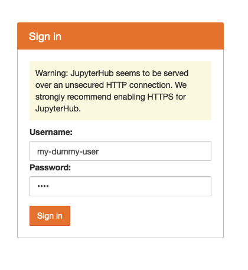
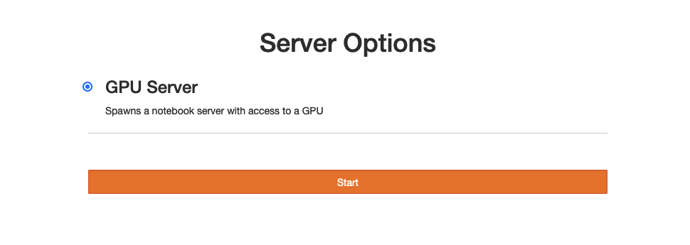

# Experimenting and creating our Serving and Training script

In this first module we are going to open JupyterHub and logging-in to create our user session, let's start by exposing JupyterHub using `kubectl port-forward.`

> **Note:** We are not exposing via LoadBalancer to avoid security risks, since we are using Jupyter dummy auth.

## Accessing JupyterHub

Exposing JupyterHub endpoint:

```bash
kubectl port-forward svc/proxy-public 8080:80 -n jupyterhub
```

> You can choose any port that you'd like (local-port):(service-port). In the above example we are using `8080`, so open the `http://localhost:8080` in your local browser.

Since we are using JupyterHub `dummy` auth mechanism, we can define **any user and password** in-order to get access to Jupyter Console:



Select [X] the GPU Server profile in JupyterHub and click in `Start`.



Now wait for the Server to start up.

## Selecting the pipeline Notebook

In the left panel there is a "notebooks" folder. You have to choose the Notebook named "`<model>`-training-pipeline.ipynb" and copy it into the root folder because the "notebooks" folder in exposed as a read-only filesystem to keep the original files.

Now you can follow the steps on Jupyter Notebook.


