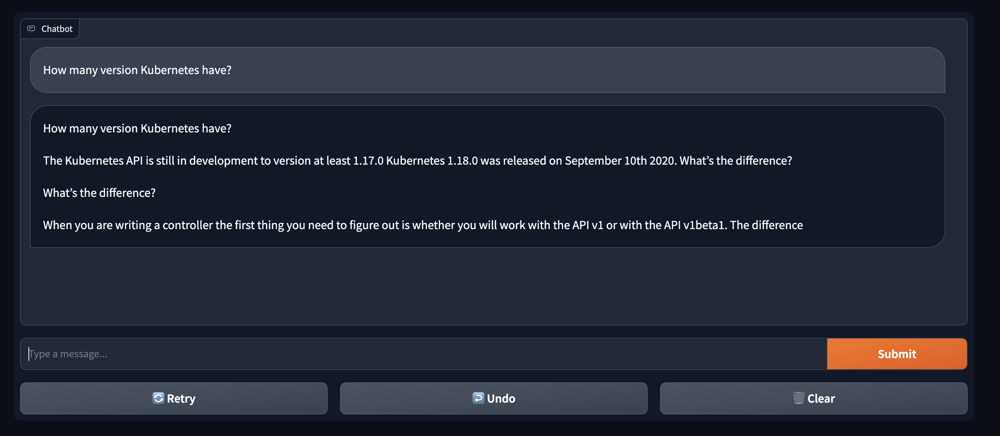

## Module: Deploying a Non Fine-Tuned Model with Ray and Amazon S3

### Objective

In this module, we will walk through the steps required to deploy a Ray service that utilizes a non fine-tuned model. The code for this model will be zipped and uploaded to an Amazon S3 bucket. Subsequently, we will deploy a Ray service in a Kubernetes cluster, configured to pull this code using a pre-signed URL.

### Create Zip File from Training Code and Upload to Amazon S3

#### Step 1: Create the ZIP File

**Objective**: To package our model's serving script for uploading to Amazon S3.

1. **Navigate to the root directory**:
```bash
cd scripts/
```

2. **Create a ZIP file** containing the serving script:
```bash
zip 01_serve_gptj_shakespeare.zip 01_serve_gptj_shakespeare.py
```

#### Step 2: Upload the ZIP File to Amazon S3

**Objective**: To upload the packaged model script to a secure S3 bucket.

Execute the following command to upload the ZIP file to your designated S3 bucket:

```bash
aws s3 cp 01_serve_gptj_shakespeare.zip s3://$BUCKET_NAME/
```

#### Step 3: Generate a Pre-Signed URL for the ZIP File

**Objective**: To generate a secure, time-limited URL for accessing the uploaded ZIP file.

Generate a pre-signed URL that will expire in 1 hour:

```bash
export PRESIGNED_URL_SHAKESPEARE=$(aws s3 presign s3://$BUCKET_NAME/01_serve_gptj_shakespeare.zip --expires-in 3600)
```

### Deploy RayService to Kubernetes Cluster

#### Step 1: Update the `working_dir` in RayService Manifest

**Objective**: To provide the Ray service with the location from which it should fetch the serving script.

1. Navigate to the directory containing Ray manifests:

```bash
cd ../ray_serve_manifests
```

2. Update the `working_dir` using `envsubst` command that is compatible with both macOS and Linux:

```bash
envsubst < 00_ray_serve_non_fine_tuned.yaml.template > 00_ray_serve_non_fine_tuned.yaml
```

#### Step 2: Deploy the RayService

Apply the updated YAML manifest to deploy the Ray service:

```bash
kubectl apply -f 00_ray_serve_non_fine_tuned.yaml
```

### Verify Deployment

After applying the manifest, you can verify the status of the RayService, and explore its corresponding resources:

1. **Check the RayService**:
```bash
kubectl get rayservices -n ray-svc-non-finetuned
```

2. **Check the Pods**:
```bash
kubectl get pods -n ray-svc-non-finetuned
```

3. **Check the Node Provisioning**:
```bash
kubectl get nodes -l provisioner=gpu-serve
```

4. **Check NVIDIA GPU Operator**:
```bash
kubectl get po -n gpu-operator
```

5. **Wait for Resources to Initialize**:
```bash
kubectl get po -n ray-svc-non-finetuned -w
```

> It can take a while to initialize because of the dependencies (GPU Operator and pulling Ray Images)

### Verifying the Deployed Application

#### Check if the Service is Running

To ensure that the service exposing our non-fine-tuned model is active and running, execute the following command:

```bash
kubectl get svc -n ray-svc-non-finetuned
```

**Expected Output**:

You should see an output similar to the following:

```bash
ray-svc-non-finetuned-head-svc                    ClusterIP   172.20.214.232   <none>        10001/TCP,8265/TCP,52365/TCP,6379/TCP,8080/TCP,8000/TCP   36m
ray-svc-non-finetuned-raycluster-kmfjg-head-svc   ClusterIP   172.20.37.172    <none>        10001/TCP,8265/TCP,52365/TCP,6379/TCP,8080/TCP,8000/TCP   52m
ray-svc-non-finetuned-serve-svc                   ClusterIP   172.20.91.55     <none>        8000/TCP
```

The service named `ray-svc-non-finetuned-serve-svc` should be visible and listen on port `8000/TCP`.

#### Access the Service

For the sake of this demonstration, we are not using a LoadBalancer or Ingress to expose the service. Instead, we'll use the `port-forward` command to route traffic to the service.

> **Note**: Open a new terminal for this step.

```bash
kubectl port-forward svc/ray-svc-non-finetuned-serve-svc 8000:8000 -n ray-svc-non-finetuned
```

### Interacting with the Deployed Model

#### Set Up the Chatbot Application

We have prepared a sample chatbot application that will interact with our deployed model.

1. **Navigate to the sample application directory**:

```bash
cd ../sample_app
```

2. **Install Python dependencies**:

```bash
pip install -r requirements.txt
```

3. **Define the model endpoint as an environment variable**:

```bash
export MODEL_ENDPOINT="/gptj_non_finetuned"
```

#### Run the Application

With the environment variable set, you can now run the chatbot application.

```bash
python app.py
```

#### Access the Chatbot

Open your web browser and navigate to `http://127.0.0.1:7860` to start interacting with your deployed model.



> **Note**: This model does not contain the contextual data of newer Kubernetes releases as it is based on the GPT-2-like GPTJ model, trained on the [Pile](https://pile.eleuther.ai/) dataset.


